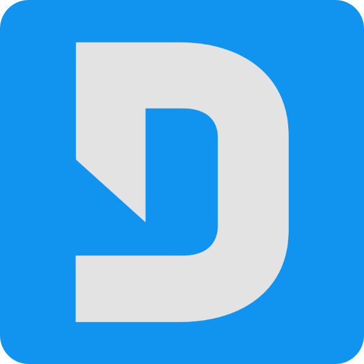

# gmrelay [](https://github.com/the-sink/gmrelay/blob/main/LICENSE) [](https://www.npmjs.com/package/discord.js) [](https://github.com/the-sink/gmrelay/issues)

A Discord &lt;-> Garry's Mod chat relay server. This relay system communicates between the GMod server and a node.js server (also serving as the discord bot) over a websocket.


Unlike other systems, this one runs a dedicated relay server (as opposed to something like a php script hosted using nginx that pipe messages in and out). This sacrifices some convenience, requiring you to run a server in the background, but makes it way more extensible and nice to work with in my opinion.

## Requirements

Node.js version: `>=16.6.0`

Uses [GWSockets](https://github.com/FredyH/GWSockets) on the GMod side. Download the neccesary dll and place it in `lua/bin`.

Node.js relay server uses [discord.js](https://www.npmjs.com/package/discord.js) and [websocket](https://www.npmjs.com/package/websocket), which should be installed automatically when `npm install` is executed in the proper folder.

## Warning

**Make sure you do not forward the port this Node.js relay server is running on** (27010 by default). The server does not have any form of authentication set up at the moment, so it should only be made accessible to the local machine/network.

This chat relay is very new and I don't have a whole lot of experience with websockets as of yet, so I wouldn't trust this on any reasonably large server until it's been tested/improved upon more.

## Usage
(These instructions assume you already know how to set up a Discord bot account, invite it to your server, and create a webhook)

**Note:** The Node.js relay server should be run on the same machine as the GMod server, or else the relay won't work.

First, install the gmrelay addon to your server by placing `addons/gmrelay` into your GMod server's `addons` folder.

Then, enter the `server` folder and duplicate `config.example.json`, renaming the new copy to `config.json`. Edit the config file as needed.

`botToken` = Your Discord bot's token. This bot must be invited to the server you're looking to use the relay on.

`channelId` = The ID of the channel you want Discord messages to be received from.

`webhookUrl` = The URL to a valid webhook, created in the channel you want messages from the GMod server to be sent to.

`serverPort` = The port number you want the relay server to operate over. Default is `27010`, only change this if you need to (you'll need to change `sv_gmrelay.lua` as well).

Finally, run the following:
```
npm install
npm start
```

Once running, you can start (or restart) your GMod server and the relay should begin working.
